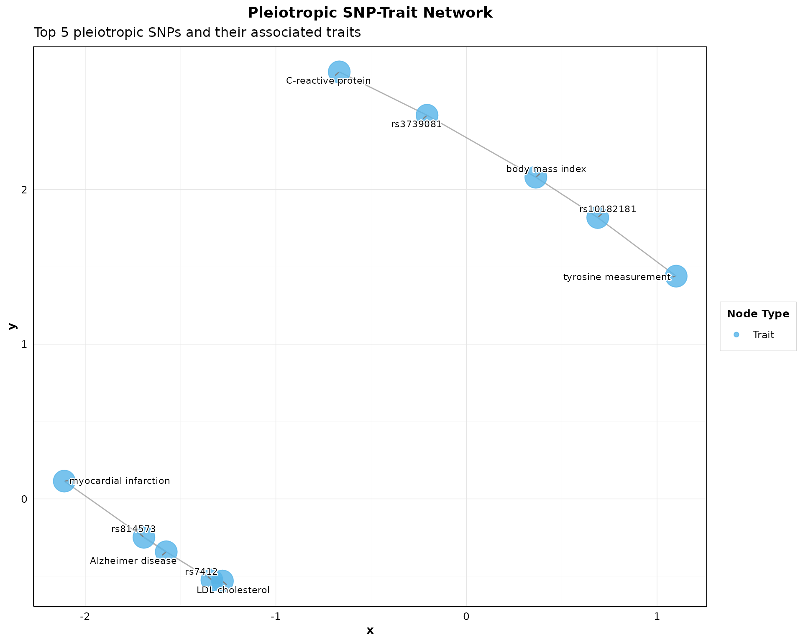
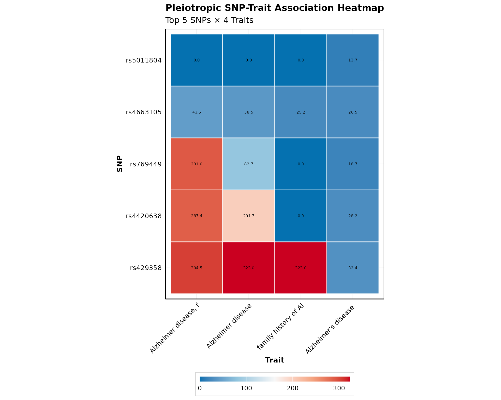
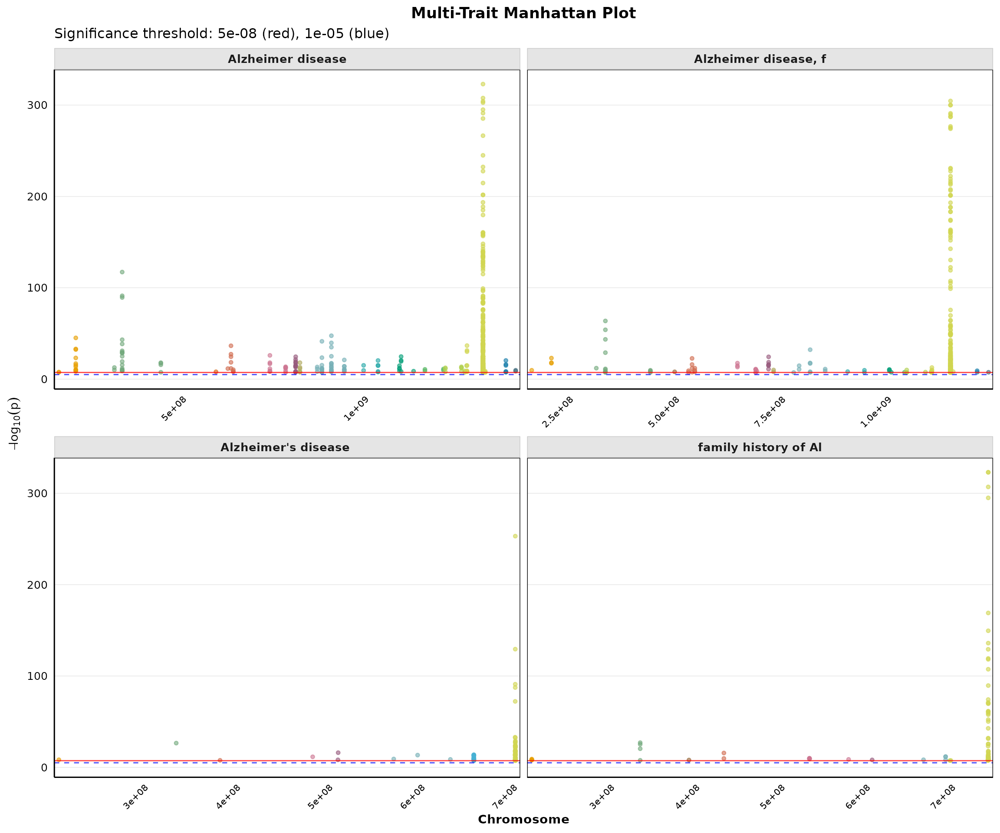
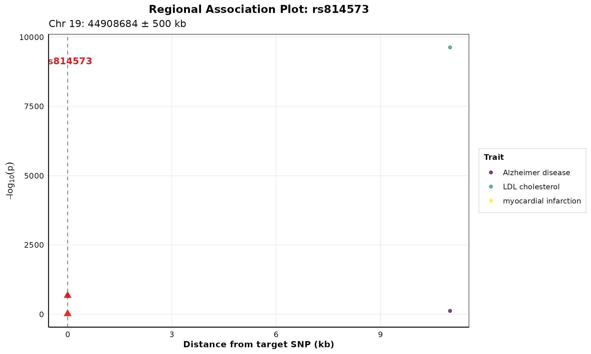
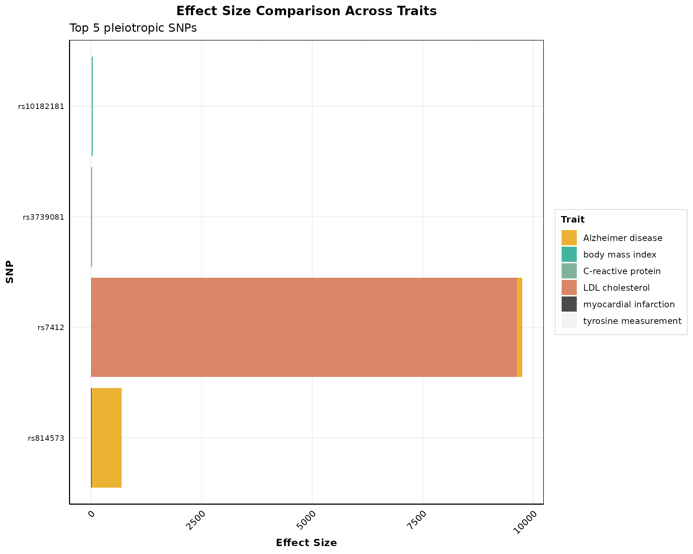
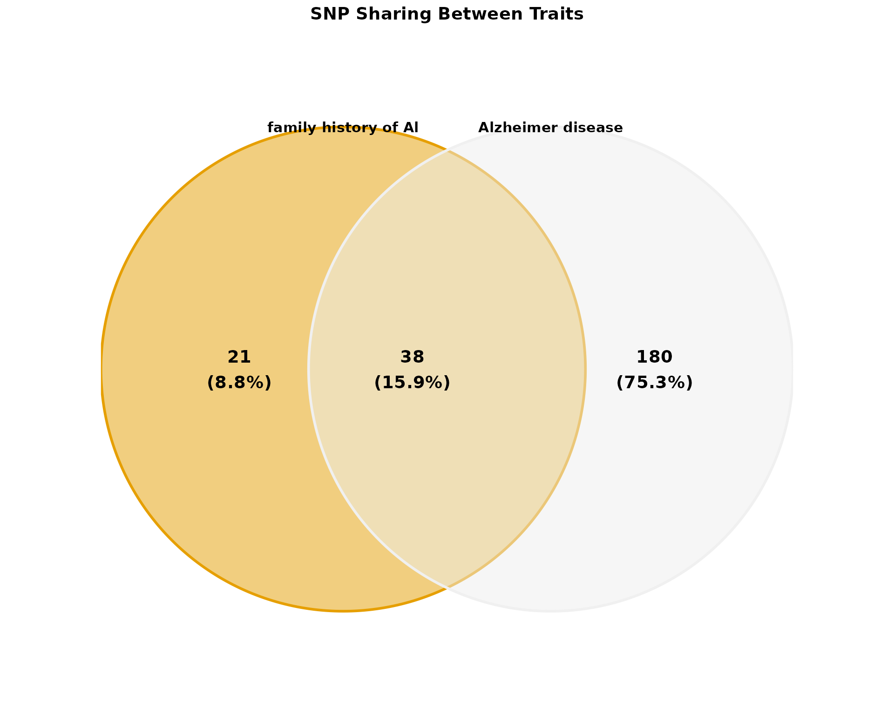
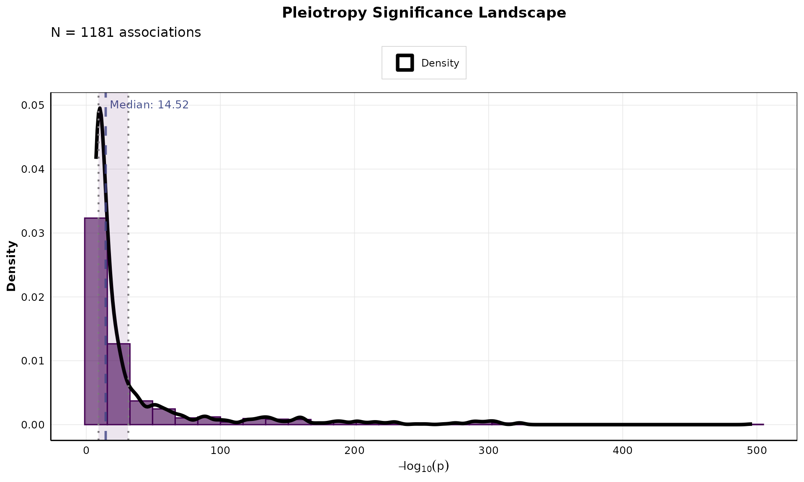

# Visualization for Pleiotropy Analysis

This vignette demonstrates the advanced visualization capabilities of
*pleior* for analyzing and presenting pleiotropic genetic associations.
These publication-ready visualizations are designed for scientific
journals and provide explainable insights into shared genetic
architecture.

## Setup

Load the package and example data:

``` r
library(pleior)
library(ggplot2)
library(dplyr)
#> 
#> Attaching package: 'dplyr'
#> The following objects are masked from 'package:stats':
#> 
#>     filter, lag
#> The following objects are masked from 'package:base':
#> 
#>     intersect, setdiff, setequal, union
data(gwas_subset)
```

Preprocess and detect pleiotropic SNPs:

``` r
gwas_clean <- preprocess_gwas(gwas_subset, pvalue_threshold = 5e-8)
pleio_results <- detect_pleiotropy(
  gwas_clean |>
    dplyr::filter(stringr::str_detect(MAPPED_TRAIT, 'Alzheimer')) 
  )
pleio_results$MAPPED_TRAIT <- substr(pleio_results$MAPPED_TRAIT, 1, 20)
head(pleio_results)
#> # A tibble: 6 × 7
#>   SNPS      N_TRAITS TRAITS              MAPPED_TRAIT PVALUE_MLOG CHR_ID CHR_POS
#>   <chr>        <int> <chr>               <chr>              <dbl> <chr>  <chr>  
#> 1 rs10119          4 Alzheimer disease;… family hist…       307   19     449034…
#> 2 rs10119          4 Alzheimer disease;… Alzheimer d…       161.  19     449034…
#> 3 rs10119          4 Alzheimer disease;… Alzheimer d…       130.  19     449034…
#> 4 rs10119          4 Alzheimer disease;… late-onset …        56.7 19     449034…
#> 5 rs1038025        2 Alzheimer disease;… Alzheimer d…        83.5 19     449017…
#> 6 rs1038025        2 Alzheimer disease;… Alzheimer d…        39   19     449017…
```

## Publication-Ready Themes

*pleior* includes publication-ready themes optimized for different
journals:

``` r
p <- ggplot(mtcars, aes(x = wt, y = mpg)) + 
  geom_point(aes(color = factor(cyl))) +
  labs(title = "Example Plot with Publication Theme")
# Default publication theme
p1 <- p + theme_pleiotropy_publication()
# Nature journal style
p2 <- p + theme_pleiotropy_publication(journal_style = "nature")
# Science journal style
p3 <- p + theme_pleiotropy_publication(journal_style = "science")
# Colorblind-friendly palettes
colors <- get_pleiotropy_colors("okabe_ito", n = 5)
print(colors)
#> [1] "#E69F00" "#3CAF66" "#6A6859" "#321E29" "#F0F0F0"
```

## Network Graph Visualization

Visualize connections between pleiotropic SNPs and their associated
traits:

``` r
if (nrow(pleio_results) > 0) {
  p_network <- plot_pleiotropy_network(
    pleio_results,
    top_n_snps = min(10, nrow(pleio_results)),
    node_size_snp = 6,
    node_size_trait = 10,
    layout = "fr",
    show_labels = TRUE,
    color_palette = "okabe_ito"
  ) + theme_pleiotropy_publication()
  
  print(p_network)
}
#> Warning: Unknown or uninitialised column: `SNP`.
#> Unknown or uninitialised column: `SNP`.
```



## Heatmap Visualization

Create a heatmap showing SNP-trait associations:

``` r
if (nrow(pleio_results) > 0) {
  p_heatmap <- plot_pleiotropy_heatmap(
    pleio_results,
    top_n_snps = min(5, nrow(pleio_results)),
    top_n_traits = 4,
    value_col = "PVALUE_MLOG",
    show_dendrograms = FALSE,
    color_palette = "bluered",
    show_values = TRUE
  )
  
  print(p_heatmap)
}
#> Warning: Using `size` aesthetic for lines was deprecated in ggplot2 3.4.0.
#> ℹ Please use `linewidth` instead.
#> ℹ The deprecated feature was likely used in the pleior package.
#>   Please report the issue at <https://github.com/danymukesha/pleior/issues>.
#> This warning is displayed once per session.
#> Call `lifecycle::last_lifecycle_warnings()` to see where this warning was
#> generated.
```



## Multi-Trait Manhattan Plot

Compare genome-wide associations across multiple traits:

``` r
if (nrow(pleio_results) > 0) {
  p_multi <- plot_multi_trait_manhattan(
    pleio_results,
    max_traits = min(4, length(unique(pleio_results$MAPPED_TRAIT))),
    significance_line = 5e-8,
    suggestive_line = 1e-5,
    point_size = 1.2,
    alpha = 0.6,
    ncol = 2
  )
  
  print(p_multi)
}
```



## Regional Association Plot

Zoom in on specific genomic regions around pleiotropic SNPs:

``` r
if (nrow(pleio_results) > 0 && "rs10401176" %in% pleio_results$SNPS) {
  p_regional <- plot_regional_association(
    pleio_results,
    target_snp = "rs10401176",
    window_size = 500000,
    highlight_color = "#E31A1C"
  )
  
  print(p_regional)
}
```



## Trait Co-occurrence Network

Visualize how traits share pleiotropic SNPs:

``` r
if (nrow(pleio_results) > 0) {
  p_cooccur <- plot_trait_cooccurrence_network(
    pleio_results,
    min_shared_snps = 1,
    top_n_traits = min(5, length(unique(pleio_results$MAPPED_TRAIT))),
    node_size = 8,
    layout = "kk",
    show_edge_labels = TRUE
    # color_by = "n_snps"
  )
  
  print(p_cooccur)
}
#> Warning in plot_trait_cooccurrence_network(pleio_results, min_shared_snps = 1,
#> : No trait pairs meet minimum shared SNP criteria
```


## Effect Size Comparison

Compare effect sizes across traits:

``` r
if (nrow(pleio_results) > 0) {
  p_effect <- plot_effect_size_comparison(
    pleio_results,
    top_n_snps = min(5, nrow(pleio_results)),
    effect_col = "PVALUE_MLOG",
    use_log_scale = FALSE,
    color_by = "trait",
    flip_coords = TRUE
  )
  
  print(p_effect)
}
```



## Venn Diagram

Visualize SNP sharing between traits:

``` r
if (nrow(pleio_results) > 0) {
  traits <- unique(pleio_results$MAPPED_TRAIT)[1:min(3, length(unique(pleio_results$MAPPED_TRAIT)))]
  
  if (length(traits) >= 2) {
    p_venn <- plot_venn_diagram(
      pleio_results,
      traits = traits[1:min(2, length(traits))],
      title = "SNP Sharing Between Traits",
      
      show_counts = TRUE,
      show_percentages = TRUE,
      color_palette = "okabe_ito",
      alpha = 0.5
    )
    
    print(p_venn)
  }
}
```



## Pleiotropy Significance Landscape

Analyze the distribution of significance values:

``` r
if (nrow(pleio_results) > 0) {
  p_landscape <- plot_pleiotropy_landscape(
    pleio_results,
    n_bins = 30,
    show_median = TRUE,
    show_mean = FALSE,
    show_quantiles = TRUE,
    color_palette = "viridis"
  )
  
  print(p_landscape)
}
```



## Combining Multiple Plots

Create multi-panel figures for publications:

``` r
if (nrow(pleio_results) > 0) {
  p1 <- plot_pleiotropy_manhattan(
    pleio_results,
    title = "Manhattan Plot",
  ) + theme_pleiotropy_publication()
  
  p2 <- plot_pleiotropy_heatmap(
    pleio_results,
    top_n_snps = min(5, nrow(pleio_results)),
    top_n_traits = 4
  )
  
  combined <- combine_publication_plots(
    p1, p2,
    ncol = 2,
    labels = c("A", "B")
  )
  
  print(combined)
}
```

## Saving Publication-Ready Figures

Export figures in high-resolution formats:

``` r
# Save as PDF (vector format for journals)
save_publication_plot(
  p_heatmap,
  "figure1_heatmap.pdf",
  width = 8,
  height = 6
)
# Save as PNG (high-resolution raster)
save_publication_plot(
  p_network,
  "figure2_network.png",
  width = 10,
  height = 8,
  dpi = 300
)
# Save as TIFF (very high quality)
save_publication_plot(
  p_multi,
  "figure3_manhattan.tiff",
  width = 12,
  height = 10,
  dpi = 600
)
```

## Customization Options

All visualization functions offer extensive customization:

- **Color palettes**: Use
  [`get_pleiotropy_colors()`](https://danymukesha.github.io/pleior/reference/get_pleiotropy_colors.md)
  with options like “okabe_ito”, “viridis”, “plasma”, “cividis”
- **Journal styles**: Apply
  [`theme_pleiotropy_publication()`](https://danymukesha.github.io/pleior/reference/theme_pleiotropy_publication.md)
  with “nature”, “science”, “pnas”, or “default”
- **Layout options**: Network layouts include “fr”, “kk”, “dh”, “grid”,
  “circle”
- **Highlighting**: Emphasize specific SNPs or traits
- **Labels and annotations**: Add custom labels, titles, and annotations

## Best Practices for Publications

1.  **Use vector formats** (PDF, SVG) when possible for journals
2.  **Set appropriate DPI** (300-600 for raster formats)
3.  **Use colorblind-friendly palettes** (e.g., “okabe_ito”)
4.  **Maintain consistent styling** across all figures
5.  **Include clear legends and annotations**
6.  **Optimize figure dimensions** for journal specifications
7.  **Use high-contrast colors** for accessibility

For more details, see the function documentation:

- [`?plot_pleiotropy_network`](https://danymukesha.github.io/pleior/reference/plot_pleiotropy_network.md)
- [`?plot_pleiotropy_heatmap`](https://danymukesha.github.io/pleior/reference/plot_pleiotropy_heatmap.md)
- [`?plot_multi_trait_manhattan`](https://danymukesha.github.io/pleior/reference/plot_multi_trait_manhattan.md)
- [`?plot_regional_association`](https://danymukesha.github.io/pleior/reference/plot_regional_association.md)
- [`?plot_trait_cooccurrence_network`](https://danymukesha.github.io/pleior/reference/plot_trait_cooccurrence_network.md)
- [`?plot_effect_size_comparison`](https://danymukesha.github.io/pleior/reference/plot_effect_size_comparison.md)
- [`?plot_venn_diagram`](https://danymukesha.github.io/pleior/reference/plot_venn_diagram.md)
- [`?plot_pleiotropy_landscape`](https://danymukesha.github.io/pleior/reference/plot_pleiotropy_landscape.md)
- [`?theme_pleiotropy_publication`](https://danymukesha.github.io/pleior/reference/theme_pleiotropy_publication.md)
- [`?save_publication_plot`](https://danymukesha.github.io/pleior/reference/save_publication_plot.md)
- [`?combine_publication_plots`](https://danymukesha.github.io/pleior/reference/combine_publication_plots.md)
